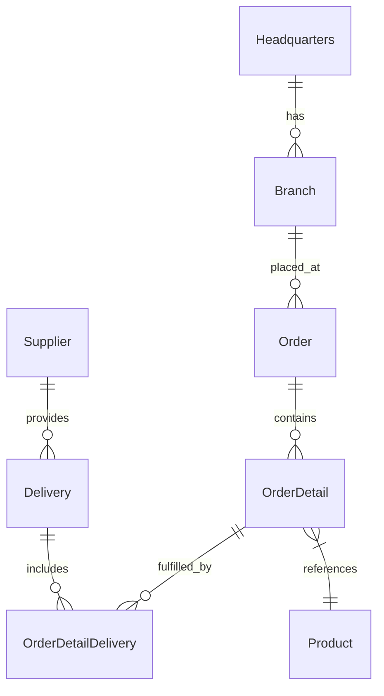

# 🚀 OctoCAT Supply Chain: The Ultimate GitHub Copilot Demo


Welcome to the OctoCAT Supply Chain Management System - your go-to demo for showcasing the incredible capabilities of GitHub Copilot, azd, and the power of AI-assisted development!

## ✨ What Makes This Demo Special

This isn't just another demo app - it's a carefully crafted showcase that demonstrates the full spectrum of GitHub's AI capabilities:

- �� **Copilot Agent Mode & Vision** - Watch Copilot understand UI designs and implement complex features across multiple files
- 🎭 **MCP Server Integration** - Demonstrate extended capabilities with Playwright for testing and GitHub API integration
- Azure Developer CLI (azd) - Use azd to deploy and manage the application seamlessly
- 🔄 **CI/CD & IaC** - Generate deployment workflows and infrastructure code with natural language
- 🎯 **Custom Instructions** - Show how Copilot can be tailored to understand internal frameworks and standards

## ��️ Architecture

The application is built using modern TypeScript with a clean separation of concerns:



### Tech Stack
- **Frontend**: React 18+, TypeScript, Tailwind CSS, Vite
- **Backend**: Express.js, TypeScript, OpenAPI/Swagger
- **DevOps**: Docker

## 🎯 Key Demo Scenarios

1. **Vibe Coding**
   - Implement a shopping cart from a design mockup
   - Watch Copilot analyze, plan, and implement across multiple files
   - Show real-time UI updates and state management

2. **IaC Code Generation**
   - Generate Bicep templates using prompts

3. **IaC Code Generation using azd**
   - Set up the application using azd
   - Deploy the application to Azure with a single command

4. **DevOps Automation**
   - Generate GitHub Actions workflows
   - Create infrastructure as code
   - Set up container deployments

## 🚀 Getting Started

1. Clone this repository
2. Build the projects:
   ```bash
   # Build API and Frontend
   npm install && npm run build
   ```
3. Start the application:
   ```bash
   npm run dev
   ```

Or use the VS Code tasks:
- `Cmd/Ctrl + Shift + P` -> `Run Task` -> `Build All`
- Use the Debug panel to run `Start API & Frontend`

### Local vs Codespaces

- This demo can work in a Codespace or locally.
- For Codespaces, ensure you have the necessary ports exposed in your `.devcontainer.json`. 
- For local development, ensure you have Docker installed and running.

### Full end-to-end Azure Deployment Demo (optional)

This demo requires the following:
- `az cli` and `gh cli` for configuring the Azure environment as well as the repo (Environments and vars, as well as OIDC config)
- You will need an Azure Subscription, of which you have owner permissions
- To configure the environment, run `az login` and make sure you have selected the correct subscription.
- Run the following command: `./infra/configure-deployment.sh <repo-name>` and make sure that it completes successfully. If it does, you will have:
  - An Azure Service Principal, correctly configured for deployment
  - 2 Azure Resource Groups (one for Prod and one for Staging)
  - an Azure Container Registry (in the prod resource group)
  - 2 Environments in the Repo (Staging, Prod) with manual approval configured on Prod
  - Actions Variables - all the vars that are needed to run the workflows
  - OIDC configuration - the script configures OIDC connection for the repo/environments so you don't have to store any secrets in GitHub!

### Demo: Using Vision and Agent to Generate Cart Functionality

- **What to show:** "Vibe coding" using Agent Mode and Vision to complete complex tasks.
- **Why:** Demonstrate how Copilot Vision can detect design and how Agent can understand a codebase and create complex changes over multiple files.
- **How:**  
1. Run the App to show the original code. Once the site starts, click on "Products" in the NavBar and show the Product Page. Add an item to the Cart - note that nothing actually happens, except a message saying, "Added to Cart". Explain that there is no Cart in the frontend app currently.
2. Open Copilot and switch to "Ask" mode. Add the `plan` prompt to the chat.
    1. Attach the [cart image](./docs/design/cart.png) using the paperclip icon or drag/drop to add it to the chat.
    2. Enter the following prompt:
       ```txt
       I need to implement a simple Cart Page. I also want a Cart icon in the NavBar that shows the number of items in the Cart.
       ```
    3. Highlight that Copilot has suggested changes and planned the components to add/modify and even asked clarifying questions.
    4. Answer some of the questions if you want to refine the plan.
    5. Switch to "Agent" mode in Copilot Chat. Switch to `Claude 3.5 Sonnet` (a good implementation model) and enter this prompt:
       ```txt
       Implement the changes.
       ```
    6. Show Copilot's changes and how you can see each one and Keep/reject each one.
    7. Accept Copilot's suggested fixes.
    8. Go back to the Frontend app. Navigate to Products. Show adding items to the cart (note the icon updating). Click on the Cart icon to navigate to the Cart page. Show the total, and adding/removing items from the cart.

### Demo: Automating Deployment with GitHub Actions, Azure and Bicep

- **What to show:** Copilot generating Actions workflows and Infrastructure-as-code.
- **Why:** Show Copilot's ability to automate CI/CD workflows.
- **How:**  
   1. Ensure that you have run the [configure-deployment.sh](./infra/configure-deployment.sh) script to set up the initial infrastructure and configure the environments and vars in the repo.
   2. Add the [deployment.md](./docs/deployment.md) file as context.
   3. Prompt Copilot Agent to `generate bicep files and workflows according to the deployment plan`
   4. Show generated files:  
      - GitHub Actions YAML to build & test
      - GitHub Actions YAML to deploy including an approval step
   5. Accept the changes
   6. Commit and push to see the pipeline execution
   7. Show the deployment
